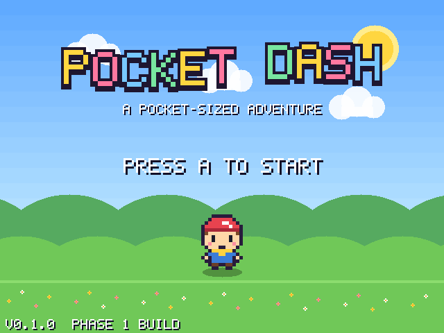
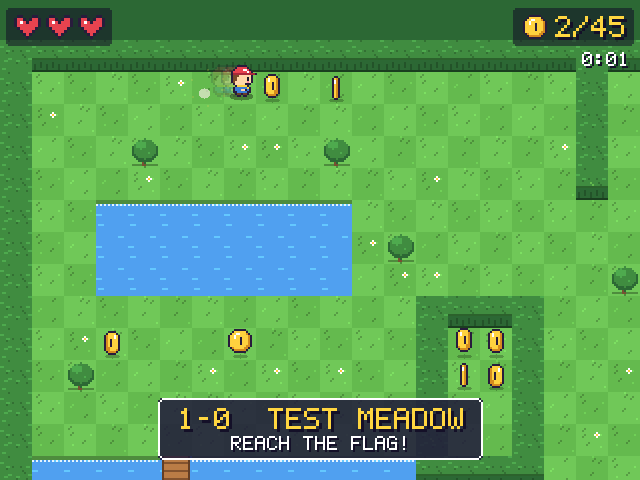
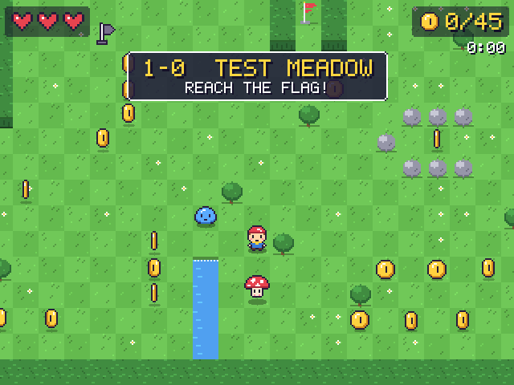
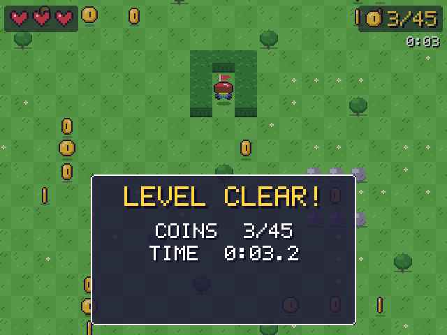

# Pocket Dash

A colourful top-down arcade adventure for the **R36S** handheld (ArkOS / Linux),
written in C++17 with SDL2. No game engine and no emulator: it builds as a
native ARM Linux executable, and it also runs on a normal PC for development.

> **Pick up and play in seconds.**

**Status:** Phases 1–3 of 8 are complete: the engine, input and movement;
tile maps, collision, a scrolling camera, coins and a level exit; and
enemies, hearts, hazards, checkpoints and the three difficulties. See
[TODO.md](TODO.md) for the roadmap.






## How to play

* **Reach the flag.** Coins are optional but count for your score.
* **Hop (A)** over thorns and small streams, and onto enemies to stomp them.
* **Dash (B)** to zip past danger, through enemies, and even across a
  one-tile stream.
* Touching an enemy, thorns or falling in water costs a heart. Heart
  pickups restore them, and checkpoint flags heal you and become your
  restart point.
* **No game over.** Run out of hearts and you go back to the last
  checkpoint with full health, keeping your coins.

| Enemy    | What it does                                                    |
|----------|-----------------------------------------------------------------|
| Slime    | Squishes down, then hops towards you                             |
| Beetle   | Walks back and forth, pausing to turn                            |
| Mushroom | Shivers, does a big bounce and sends a shockwave ring: hop it!   |

**Difficulty:** *Relaxed* gives 5 hearts, slower enemies and extra checkpoints.
*Normal* is the default. *Challenge* has faster enemies, fewer checkpoints and
a higher score multiplier. Every level and secret is available on all three.
Set it with `--difficulty relaxed|normal|challenge` (the settings menu comes
in Phase 6).

---

## Controls

| R36S          | Keyboard (default)  | Action                          |
|---------------|---------------------|---------------------------------|
| D-pad / stick | Arrow keys          | Move                            |
| A             | Z or Space          | Hop / confirm                   |
| B             | X or Left Shift     | Dash / back                     |
| X             | A                   | Use power-up *(Phase 4)*        |
| Y             | S                   | Interact *(Phase 5)*            |
| Start         | Enter or Esc        | Pause                           |
| Select        | Backspace or Tab    | Level info                      |
| Select + Start (hold) | window close | Quit                            |
| Select + L1   | F1                  | Toggle debug overlay            |
| R1 *(debug on)* | W *(debug on)*    | Warp next to the level exit     |
| L1 *(debug on)* | Q *(debug on)*    | Warp to the next enemy          |
| –             | F11                 | Toggle fullscreen               |

The spec's keyboard layout puts the X/Y buttons on the **A** and **S** keys,
which clash with WASD movement. Arrow keys are therefore the default. A
complete WASD layout (with J/K/L/I as face buttons) is in
`config/controller.cfg`; uncomment it to switch.

## Controller configuration (R36S)

Different R36S firmware images report different SDL button numbers, so the
game never assumes a layout. Instead, it reads them from
**`config/controller.cfg`**:

```ini
A=1
B=0
X=2
Y=3
L1=4
R1=5
SELECT=12
START=13
DPAD_UP=8      # d-pad as buttons; hats are also handled (USE_HAT=1)
AXIS_X=0       # left stick
DEADZONE=8000
```

The defaults match the ArkOS "GO-Super Gamepad" layout used on RK3326
handhelds. If a button does the wrong thing:

1. Press **Select + L1** (or set `DEBUG_OVERLAY=1` in the config) to show the
   debug overlay.
2. Hold the button. Its number appears on the `BTN` line, and the `HAT` and
   `AXES` lines show the d-pad and stick.
3. Put that number in `controller.cfg`. You don't need to recompile.

At startup the game also logs the joystick name, GUID, button, axis and hat
counts, and SDL's own mapping string for the device. Under ArkOS this log goes
to `log.txt`.

## Building

Requirements: CMake ≥ 3.13, a C++17 compiler, and SDL2, SDL2_image,
SDL2_ttf and SDL2_mixer development packages.

### Linux (development PC)

```bash
sudo apt install build-essential cmake pkg-config \
    libsdl2-dev libsdl2-image-dev libsdl2-ttf-dev libsdl2-mixer-dev
cmake -B build -DCMAKE_BUILD_TYPE=Release
cmake --build build -j
./build/pocketdash            # windowed 2x; --help lists options
```

The game finds `assets/` and `config/` by itself: it searches the executable's
folder and its parents, then the working directory, and `$POCKETDASH_DATA`
overrides both. So you can run it straight from `build/`.

### Tests

```bash
cd build && ctest --output-on-failure
```

* `unit_tests` covers the config parser, input bindings and latching, the
  joystick event mapping, player physics (acceleration, dash, hop, knockback),
  map parsing, tile collision (sliding, no tunnelling, corner nudge), the
  camera, coins, save round-trips, data-table validation, and a reachability
  check that every coin and the exit can be reached in the built-in level.
* `smoke_test` runs the real game loop headless (`SDL_VIDEODRIVER=dummy`). It
  plays a scripted run: title → walk (collecting coins) → dash → hop → pause
  → resume → debug-warp → walk into the flag. It checks each step, including
  that the level clears.

To get screenshots without a display:
`SDL_VIDEODRIVER=dummy ./build/pocketdash --windowed --scale 1 --frames 60 --screenshot shot.png`

### Windows

With [vcpkg](https://vcpkg.io):

```bat
vcpkg install sdl2 sdl2-image sdl2-ttf sdl2-mixer
cmake -B build -DCMAKE_TOOLCHAIN_FILE=%VCPKG_ROOT%/scripts/buildsystems/vcpkg.cmake
cmake --build build --config Release
```

With MSYS2 / MinGW, install `mingw-w64-x86_64-SDL2{,_image,_ttf,_mixer}` and
use the Linux instructions. *(The Windows build is not yet tested. The code
avoids POSIX-only APIs.)*

### R36S / ArkOS: recommended, Docker cross-build

ArkOS is based on Ubuntu 19.10 (glibc 2.30). A binary built on a current
distro needs a newer glibc and **will not start** on the device. The Docker
build compiles inside Ubuntu 20.04 against arm64 SDL2. It also checks that the
result needs nothing newer than `GLIBC_2.30`.

```bash
tools/build-arkos.sh          # -> dist/PocketDash/
# If Docker Hub rate-limits you:
BASE_IMAGE=mirror.gcr.io/library/ubuntu:20.04 tools/build-arkos.sh
```

This has been verified: the resulting binary needs at most `GLIBC_2.27` and
`GLIBCXX_3.4.26`, and the stripped binary is about 150 KB. It links against
the system SDL2, SDL2_image, SDL2_ttf and SDL2_mixer. If a firmware image
lacks one of these, put the aarch64 `.so` files in `PocketDash/libs/`. The
launcher adds that folder to `LD_LIBRARY_PATH`.

Then copy the files to the SD card:

```
/roms/ports/PocketDash/        <- contents of dist/PocketDash/
/roms/ports/PocketDash.sh      <- copy of dist/PocketDash/PocketDash.sh
```

Restart EmulationStation. **Pocket Dash** then appears under *Ports*.

### R36S: native build on the device

If the device has a compiler and the SDL2 dev packages installed (over SSH):

```bash
cmake -B build -DPOCKETDASH_R36S=ON -DCMAKE_BUILD_TYPE=Release
cmake --build build -j4
cmake --install build --prefix /roms/ports/PocketDash
```

### ARM cross-compilation (manual)

`cmake/toolchains/aarch64-linux-gnu.cmake` works with any aarch64 GCC:

```bash
# Against a copy of the device's root filesystem (best compatibility):
cmake -B build-r36s -DCMAKE_TOOLCHAIN_FILE=cmake/toolchains/aarch64-linux-gnu.cmake \
      -DPOCKETDASH_R36S=ON -DPOCKETDASH_SYSROOT=/path/to/arkos-rootfs
cmake --build build-r36s -j
```

Without `POCKETDASH_SYSROOT`, it uses Debian/Ubuntu multiarch packages
(`libsdl2-dev:arm64`, …). Remember the glibc caveat above.

`-DPOCKETDASH_R36S=ON` makes the game start fullscreen and adds
`-mcpu=cortex-a35`. On Linux the game also defaults to fullscreen whenever no
X11/Wayland session exists (KMSDRM console).

## Project layout

```
PocketDash/
├── CMakeLists.txt
├── README.md / TODO.md
├── src/
│   ├── main.cpp            command-line options, entry point
│   ├── Game.*              SDL setup, fixed-timestep loop, scenes, debug overlay, smoke test
│   ├── Platform.*          *all* platform-specific decisions (paths, fullscreen)
│   ├── InputManager.*      keyboard + raw joystick → logical actions, config loading
│   ├── Player.*            movement, dash, hop, knockback, rendering
│   ├── Scene.h             scene interface
│   ├── TitleScene.*        title screen (main menu in Phase 6)
│   ├── PlayScene.*         gameplay presentation: camera, sound, HUD, pause, results
│   ├── LevelSession.*      gameplay simulation (no SDL): rules, damage, checkpoints
│   ├── Enemy.*             slime / beetle / mushroom behaviours and drawing
│   ├── EntityTypes.h       enemy and checkpoint spawn data
│   ├── Difficulty.h        per-difficulty rules
│   ├── Level.*             tile map, ASCII map parser, tile collision (moveAndCollide)
│   ├── BuiltinLevels.*     levels compiled into the game (test meadow)
│   ├── TileSet.*           per-world procedural tile atlas + visible-tile renderer
│   ├── Camera.*            dead-zone follow camera with look-ahead and shake
│   ├── Collectibles.*      coins (stars/gems in Phase 4)
│   ├── Effects.*           fixed-size pool of sparkles and dust
│   ├── AudioManager.*      SDL2_mixer wrapper, silent when audio/files are missing
│   ├── SaveManager.*       INI-style key=value store, settings persistence
│   ├── Sprites.*           programmatic placeholder pixel art (PNG overrides)
│   ├── UI.*                built-in bitmap font, panels
│   ├── Draw.*              shape helpers
│   ├── World.*             the 7 world definitions (themes, rules)
│   ├── PowerUp.*           power-up types and timers
│   └── Math.h, Constants.h, Settings.h, SdlPtr.h
├── tests/test_main.cpp
├── assets/{sprites,audio,fonts,levels}/
├── config/controller.cfg
├── save/                   created at runtime (settings.ini, progress)
├── cmake/toolchains/       aarch64 cross toolchain
├── dist/PocketDash.sh      ArkOS Ports launcher
└── tools/                  Docker-based ArkOS build
```

### Design notes

* **Fixed 60 Hz timestep.** Physics behave identically on a fast PC and on
  the RK3326. With vsync, timing jitter snaps to exactly one step per frame,
  which avoids micro-stutter.
* **640×480 logical resolution** with nearest-neighbour, integer scaling. On
  the R36S this maps 1:1.
* **No allocations in the frame loop.** Tile art is baked into one atlas,
  text uses a single font atlas, effects live in a fixed pool, and debug
  strings use stack buffers. Only visible tiles are drawn.
* **Levels are ASCII maps** (`#` hedge, `T` tree, `~` water, `=` bridge,
  `^` thorns, `c` coin, `h` heart, `s`/`b`/`B`/`m` enemies, `C`/`k`/`r`
  checkpoints, `P` spawn, `E` exit — see `src/Level.h`). Phase 5 loads them
  from `assets/levels/`.
* **Gameplay is a pure simulation.** `LevelSession` has no SDL rendering or
  input code. The unit tests play through small ASCII maps (stomping, water
  rescues, knock-outs, checkpoints) without opening a window.
* **Input presses are latched** until a simulation step consumes them, so a
  tap shorter than a frame is never lost and never seen twice.
* **RAII everywhere.** SDL handles live in `std::unique_ptr` with custom
  deleters (`SdlPtr.h`). SDL itself is initialised and shut down by a member
  object.
* **Art is optional.** Placeholder sprites come from palette strings in
  `Sprites.cpp`. To replace one, drop `assets/sprites/player.png` (2 frames ×
  3 facings of 16×16: front, back, side) or `heart_full.png` /
  `heart_empty.png` into the folder. Missing audio files are silently
  skipped. See `assets/audio/README.md`.
