# Pocket Dash

A colourful top-down arcade adventure for the **R36S** handheld (ArkOS / Linux),
written in C++17 with SDL2. No game engine and no emulator: it builds as a
native ARM Linux executable, and it also runs on a normal PC for development.

> **Pick up and play in seconds.**

**Status:** Phases 1–7 of 8 are complete. World 1 has 8 levels loaded from
data files, with objectives (coins, stars, rescues, timed runs), signs,
rafts, keys and secrets. It also has enemies, hearts, checkpoints, the three
difficulties, eight power-ups and breakable blocks. The game has a main
menu, a level-select map, scores with high-score tables, settings
(including a controller test and button remapping), saves, and a collection
of outfits unlocked with gems. Level 1-8 ends World 1 with a boss fight
against the Meadow Guardian. See [TODO.md](TODO.md) for the roadmap.


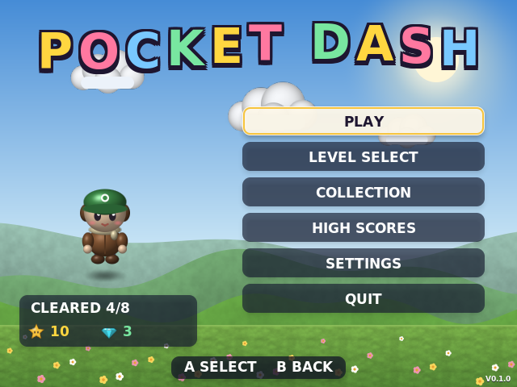
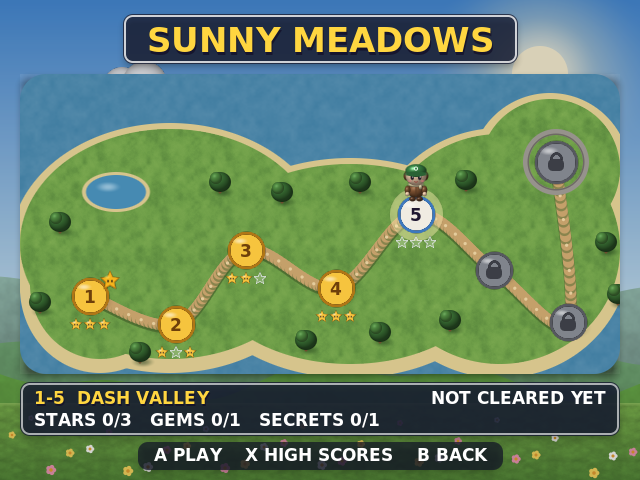


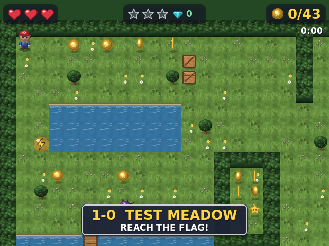
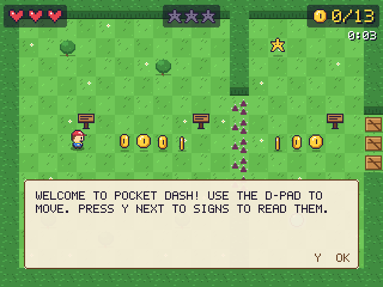
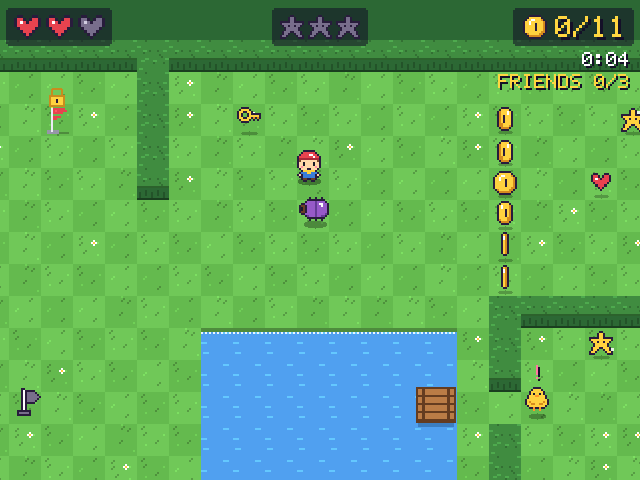

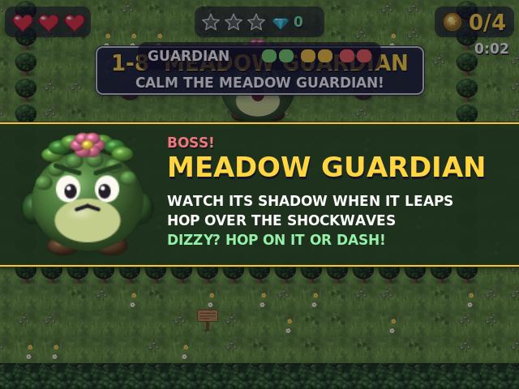
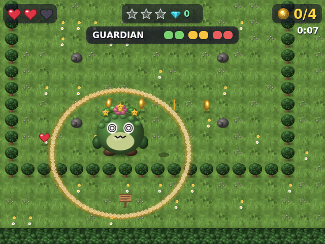
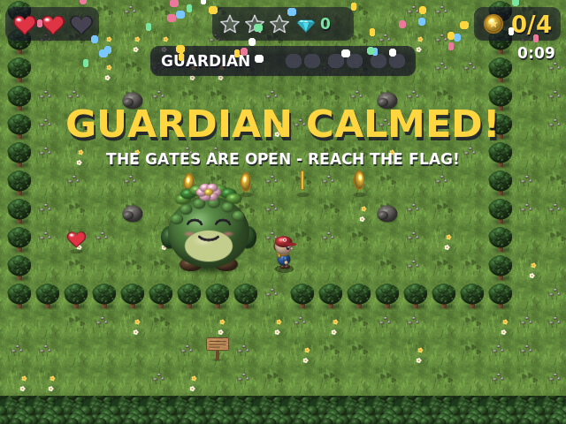
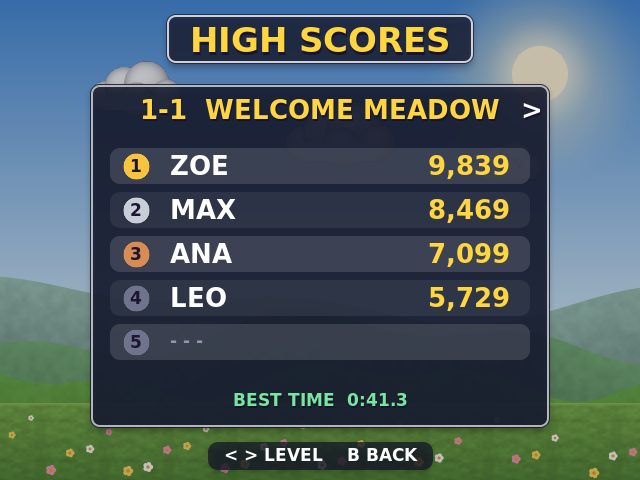
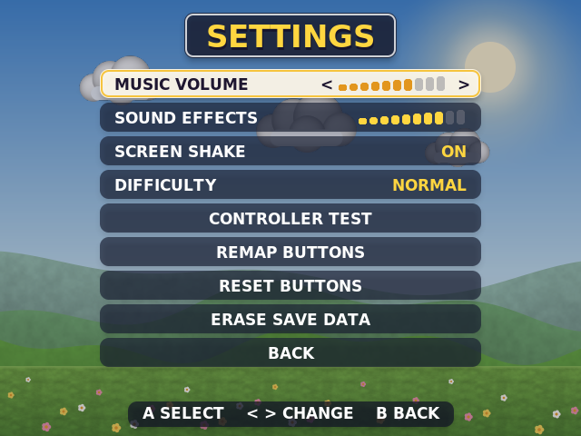
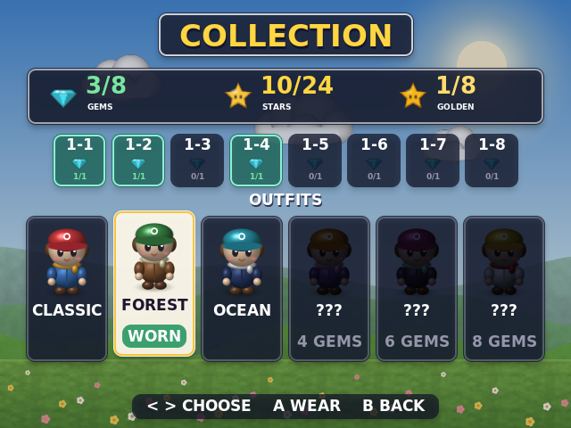

## How to play

* **Each level has a goal**, shown when it starts: reach the flag, collect
  coins, find the stars, rescue lost chicks (press **Y** next to them) or
  beat the clock. Until the goal is done, the flag wears a padlock.
* **Signs** explain new things. Stand next to one and press **Y**.
* **Rafts** carry you across rivers, and a **key** opens a locked gate.
* **Hop (A)** over thorns and small streams, and onto enemies to stomp them.
* **Dash (B)** to zip past danger, through enemies, and even across a
  one-tile stream.
* Touching an enemy, thorns or falling in water costs a heart. Heart
  pickups restore them, and checkpoint flags heal you and become your
  restart point.
* **No game over.** Run out of hearts and you go back to the last
  checkpoint with full health, keeping your coins.
* **Find the three hidden stars** in every level, and its hidden gem. Get
  every star, coin and gem in one run to earn the **Golden Star**.
* **Gems unlock outfits** for the hero on the **Collection** screen. Gems are
  never spent: finding 1, 2, 4, 6 and all 8 gems unlocks a new outfit.
* **Power-ups** float in bubbles. You hold one at a time and press **X**
  to use it:

| Power-up      | Effect                                                     |
|---------------|------------------------------------------------------------|
| Speed Shoes   | Run 50% faster                                             |
| Shield Bubble | Blocks one hit (or one fall into water)                    |
| Magnet        | Nearby coins fly to you                                    |
| Super Dash    | Dashes go twice as far and recharge faster                 |
| Double Coins  | Coins count twice for your score                           |
| Tiny Mode     | Shrink to slip through little holes in hedges              |
| Giant Mode    | Grow huge: smash crates and boulders, flatten enemies      |
| Rainbow Star  | Nothing can hurt you, and enemies you touch are defeated   |

  Dashing smashes wooden crates; only a giant can break boulders.

| Enemy    | What it does                                                    |
|----------|-----------------------------------------------------------------|
| Slime    | Squishes down, then hops towards you                             |
| Beetle   | Walks back and forth, pausing to turn                            |
| Mushroom | Shivers, does a big bounce and sends a shockwave ring: hop it!   |

**The Meadow Guardian (level 1-8).** A big mossy guardian sleeps in a
clearing. Walk in and it wakes up, and the clearing's gates close behind you.

* It shuffles towards you, and touching it hurts.
* When it **crouches and flashes red**, it is about to leap at the spot
  where you stand. A shadow and a red ring show where it will land, so step
  away.
* Its landing sends **shockwave rings** across the ground. **Hop (A)** over
  them; a "HOP!" bubble appears when one is about to reach you.
* After landing it is **dizzy** (spiral eyes, circling stars). **Hop on it**
  or **dash into it** to land a hit.
* It takes six hits over three phases, shown on its health bar. In phase 2
  each landing sends two rings. In phase 3 it leaps twice in a row.
* If you run out of hearts, it goes back to sleep but keeps the hits you
  landed. When it is beaten it calms down, the gates open, and the flag is
  yours. Calming it is worth 1,500 points.

**Difficulty:** *Relaxed* gives 5 hearts, slower enemies and extra checkpoints.
*Normal* is the default. *Challenge* has faster enemies, fewer checkpoints and
a higher score multiplier. Every level and secret is available on all three.
Change it in **Settings** (it applies from the next level), or with
`--difficulty relaxed|normal|challenge`.

### Menus, scores and saves

* **Main menu:** Play (continues at your first unfinished level), Level
  Select, Collection, High Scores, Settings and Quit. Held directions
  repeat, so long lists are quick to scroll.
* **Level select:** World 1 as a map. A level opens when the one before it
  is cleared. Each stop shows the stars you have found and a gold star for a
  Golden Star run. The panel below shows your best score, best time, and the
  stars, gems and secrets you have found. Press **X** for that level's high
  scores.
* **Score** at the end of a level:

  | What               | Points                                   |
  |--------------------|------------------------------------------|
  | Coin               | 10 (Double Coins counts them twice)      |
  | Enemy              | 50                                       |
  | Star               | 500                                      |
  | Secret             | 300                                      |
  | Heart left         | 200                                      |
  | Time bonus         | 10 per second under par (the time limit, or 2:00) |
  | Golden Star        | 2,000                                    |

  The total is multiplied by the difficulty: ×1.5 on Challenge.
* **High scores:** each level keeps a top 5. A score that makes the table
  asks for three initials: Up/Down changes the letter, and A moves on.
* **Settings:** music and effects volume, screen shake, difficulty, a
  **controller test** (every action lights up, with raw button numbers; hold
  B to leave), **remap buttons**, reset buttons, and **erase save data**
  (hold A for 2 seconds).
* **Saves** go to `save/` next to the game: `settings.ini`, `progress.ini`
  (unlocks, records, high scores, gems, outfit) and `controller.cfg` (only if
  you remapped buttons). Files are written atomically, so switching off
  mid-save cannot corrupt them.

---

## Controls

| R36S          | Keyboard (default)  | Action                          |
|---------------|---------------------|---------------------------------|
| D-pad / stick | Arrow keys          | Move                            |
| A             | Z or Space          | Hop / confirm                   |
| B             | X or Left Shift     | Dash / back                     |
| X             | A                   | Use the stored power-up         |
| Y             | S                   | Read signs, rescue lost friends |
| Start         | Enter or Esc        | Pause                           |
| Select        | Backspace or Tab    | Level info                      |
| Select + Start (hold) | window close | Quit                            |
| Select + L1   | F1                  | Toggle debug overlay            |
| R1 *(debug on)* | W *(debug on)*    | Warp next to the level exit     |
| L1 *(debug on)* | Q *(debug on)*    | Warp to the next enemy          |
| R2 *(debug on)* | 2 *(debug on)*    | Calm the boss at once           |
| –             | F11                 | Toggle fullscreen               |

The spec's keyboard layout puts the X/Y buttons on the **A** and **S** keys,
which clash with WASD movement. Arrow keys are therefore the default. A
complete WASD layout (with J/K/L/I as face buttons) is in
`config/controller.cfg`; uncomment it to switch.

## Controller configuration (R36S)

Different R36S firmware images report different SDL button numbers, so the
game never assumes a layout. Instead, it reads them from
**`config/controller.cfg`**:

```ini
A=1
B=0
X=2
Y=3
L1=4
R1=5
SELECT=12
START=13
DPAD_UP=8      # d-pad as buttons; hats are also handled (USE_HAT=1)
AXIS_X=0       # left stick
DEADZONE=8000
```

The defaults match the ArkOS "GO-Super Gamepad" layout used on RK3326
handhelds. If a button does the wrong thing:

1. Press **Select + L1** (or set `DEBUG_OVERLAY=1` in the config) to show the
   debug overlay.
2. Hold the button. Its number appears on the `BTN` line, and the `HAT` and
   `AXES` lines show the d-pad and stick.
3. Put that number in `controller.cfg`. You don't need to recompile.

You can also do this in the game: **Settings → Controller Test** shows every
action and the raw button numbers. **Settings → Remap Buttons** asks you to
press each button in turn. If no button is pressed within 5 seconds, the
current one is kept; this lets you skip d-pads that report as a hat. The new
layout is only kept if you confirm it with the new A button within 8
seconds; otherwise the old buttons come back. Remapped buttons are saved to
`save/controller.cfg`, which is applied on top of `config/controller.cfg`.
**Reset Buttons** removes it.

At startup the game also logs the joystick name, GUID, button, axis and hat
counts, and SDL's own mapping string for the device. Under ArkOS this log goes
to `log.txt`.

## Building

Requirements: CMake ≥ 3.13, a C++17 compiler, and SDL2, SDL2_image,
SDL2_ttf and SDL2_mixer development packages.

### Linux (development PC)

```bash
sudo apt install build-essential cmake pkg-config \
    libsdl2-dev libsdl2-image-dev libsdl2-ttf-dev libsdl2-mixer-dev
cmake -B build -DCMAKE_BUILD_TYPE=Release
cmake --build build -j
./build/pocketdash            # windowed 2x; --help lists options
```

The game finds `assets/` and `config/` by itself: it searches the executable's
folder and its parents, then the working directory, and `$POCKETDASH_DATA`
overrides both. So you can run it straight from `build/`.

### Levels

Levels are plain-text files in `assets/levels/` (format: `src/LevelLoader.h`,
map legend: `src/Level.h`). They are generated by `tools/make_world1.py`,
which refuses to write a level with unreachable stars, coins or friends.

```bash
./build/pocketdash --play --level 1-4    # jump straight into a level
./build/pocketdash --check-levels        # validate the level files (also handy on the device)
```

### Tests

```bash
cd build && ctest --output-on-failure
```

* `unit_tests` covers the config parser, input bindings and latching, the
  joystick event mapping, player physics (acceleration, dash, hop, knockback),
  map parsing, tile collision (sliding, no tunnelling, corner nudge), the
  camera, coins, save round-trips, data-table validation, and a reachability
  check that every coin and the exit can be reached in the built-in level.
* `level_files` loads every shipped level through the runtime data path.
* The unit tests also check every shipped level. Each must parse, have 3
  stars, and keep every coin, star, friend, key and the exit reachable using
  only abilities that level provides.
* `smoke_test` runs the real game loop headless (`SDL_VIDEODRIVER=dummy`). It
  plays a scripted run: title → menu → walk (collecting coins) → dash → hop
  → pause → resume → debug-warp → walk into the flag. It checks each step,
  including that the level clears.
* `menu_test` walks through every menu screen headless. It covers level
  select (including a locked level), high scores, collection, every settings
  page (volume, controller test, remap without a controller, erase), the
  pause menu and the way back. It checks which screen is showing at each
  step.
* The unit tests also cover scoring, progress records, level unlocking, the
  high-score table, outfits and `progress.ini` round trips (including
  damaged files).

Automated runs (`--smoke-test`, `--menu-test`, `--frames N`) use default
settings and empty progress, and never write to `save/`.

To get screenshots without a display:
`SDL_VIDEODRIVER=dummy ./build/pocketdash --windowed --scale 1 --frames 60 --screenshot shot.png`.
Add `--scene levels` (or `menu`, `scores`, `settings`, `controls`,
`collection`) to start on a menu screen, and `--demo-progress` to fill it
with sample records.

### Windows

With [vcpkg](https://vcpkg.io):

```bat
vcpkg install sdl2 sdl2-image sdl2-ttf sdl2-mixer
cmake -B build -DCMAKE_TOOLCHAIN_FILE=%VCPKG_ROOT%/scripts/buildsystems/vcpkg.cmake
cmake --build build --config Release
```

With MSYS2 / MinGW, install `mingw-w64-x86_64-SDL2{,_image,_ttf,_mixer}` and
use the Linux instructions. *(The Windows build is not yet tested. The code
avoids POSIX-only APIs.)*

### R36S / ArkOS: recommended, Docker cross-build

ArkOS is based on Ubuntu 19.10 (glibc 2.30). A binary built on a current
distro needs a newer glibc and **will not start** on the device. The Docker
build compiles inside Ubuntu 20.04 against arm64 SDL2. It also checks that the
result needs nothing newer than `GLIBC_2.30`.

```bash
tools/build-arkos.sh          # -> dist/PocketDash/
# If Docker Hub rate-limits you:
BASE_IMAGE=mirror.gcr.io/library/ubuntu:20.04 tools/build-arkos.sh
```

This has been verified: the resulting binary needs at most `GLIBC_2.27` and
`GLIBCXX_3.4.26`, and the stripped binary is about 150 KB. It links against
the system SDL2, SDL2_image, SDL2_ttf and SDL2_mixer. If a firmware image
lacks one of these, put the aarch64 `.so` files in `PocketDash/libs/`. The
launcher adds that folder to `LD_LIBRARY_PATH`.

Then copy the files to the SD card:

```
/roms/ports/PocketDash/        <- contents of dist/PocketDash/
/roms/ports/PocketDash.sh      <- copy of dist/PocketDash/PocketDash.sh
```

Restart EmulationStation. **Pocket Dash** then appears under *Ports*.

### R36S: native build on the device

If the device has a compiler and the SDL2 dev packages installed (over SSH):

```bash
cmake -B build -DPOCKETDASH_R36S=ON -DCMAKE_BUILD_TYPE=Release
cmake --build build -j4
cmake --install build --prefix /roms/ports/PocketDash
```

### ARM cross-compilation (manual)

`cmake/toolchains/aarch64-linux-gnu.cmake` works with any aarch64 GCC:

```bash
# Against a copy of the device's root filesystem (best compatibility):
cmake -B build-r36s -DCMAKE_TOOLCHAIN_FILE=cmake/toolchains/aarch64-linux-gnu.cmake \
      -DPOCKETDASH_R36S=ON -DPOCKETDASH_SYSROOT=/path/to/arkos-rootfs
cmake --build build-r36s -j
```

Without `POCKETDASH_SYSROOT`, it uses Debian/Ubuntu multiarch packages
(`libsdl2-dev:arm64`, …). Remember the glibc caveat above.

`-DPOCKETDASH_R36S=ON` makes the game start fullscreen and adds
`-mcpu=cortex-a35`. On Linux the game also defaults to fullscreen whenever no
X11/Wayland session exists (KMSDRM console).

## Project layout

```
PocketDash/
├── CMakeLists.txt
├── README.md / TODO.md
├── src/
│   ├── main.cpp            command-line options, entry point
│   ├── Game.*              SDL setup, fixed-timestep loop, scenes, debug overlay, smoke test
│   ├── Platform.*          *all* platform-specific decisions (paths, fullscreen)
│   ├── InputManager.*      keyboard + raw joystick → logical actions, config loading
│   ├── Player.*            movement, dash, hop, knockback, rendering
│   ├── Scene.h             scene interface
│   ├── TitleScene.*        title screen and main menu
│   ├── LevelSelectScene.*  World 1 map: unlocks, stars, records
│   ├── HighScoresScene.*   per-level top-5 tables
│   ├── SettingsScene.*     options, controller test, button remap, erase save
│   ├── CollectionScene.*   gems found and outfits
│   ├── Menu.*              shared menu rows, header, hint bar, auto-repeat navigation
│   ├── Backdrop.*          painted meadow behind the title and menus
│   ├── Score.*             end-of-level score breakdown
│   ├── Progress.*          records, unlocks, high scores, outfits (no SDL)
│   ├── PlayScene.*         gameplay presentation: camera, sound, HUD, pause, results
│   ├── LevelSession.*      gameplay simulation (no SDL): rules, damage, checkpoints
│   ├── Enemy.*             slime / beetle / mushroom behaviours and drawing
│   ├── Boss.*              the Meadow Guardian's state machine and shockwave rings (no SDL)
│   ├── EntityTypes.h       enemy and checkpoint spawn data
│   ├── Difficulty.h        per-difficulty rules
│   ├── Level.*             tile map, ASCII map parser, tile collision (moveAndCollide)
│   ├── LevelLoader.*       .lvl file parser and the World 1 level list
│   ├── BuiltinLevels.*     built-in test meadow (fallback; used by the smoke test)
│   ├── TileSet.*           per-world procedural tile atlas + visible-tile renderer
│   ├── Camera.*            dead-zone follow camera with look-ahead and shake
│   ├── Collectibles.*      coins (with magnet), stars, gems, power-up bubbles, hearts
│   ├── Effects.*           fixed-size pool of sparkles and dust
│   ├── AudioManager.*      SDL2_mixer wrapper, silent when audio/files are missing
│   ├── SaveManager.*       INI-style key=value store; settings, progress and button files
│   ├── Canvas.*            software painter: anti-aliased shapes, shading, tileable noise
│   ├── Sprites.*           procedurally painted sprites (PNG overrides)
│   ├── UI.*                TTF font atlases (pixel-font fallback), panels
│   ├── Draw.*              shape helpers, anti-aliased skin (circles, rounded panels)
│   ├── World.*             the 7 world definitions (themes, rules)
│   ├── PowerUp.*           power-up types, durations, active timers and the slot
│   └── Math.h, Constants.h, Settings.h, SdlPtr.h
├── tests/test_main.cpp
├── assets/{sprites,audio,fonts,levels}/
├── config/controller.cfg
├── save/                   created at runtime (settings.ini, progress)
├── cmake/toolchains/       aarch64 cross toolchain
├── dist/PocketDash.sh      ArkOS Ports launcher
└── tools/                  Docker-based ArkOS build, World 1 level generator + checker
```

### Design notes

* **Fixed 60 Hz timestep.** Physics behave identically on a fast PC and on
  the RK3326. With vsync, timing jitter snaps to exactly one step per frame,
  which avoids micro-stutter.
* **640×480 logical resolution** with integer window scaling. On the R36S
  this maps 1:1.
* **Modern look, no image files.** All art is painted once at startup by
  `Canvas`: anti-aliased shapes, sphere lighting, soft shadows and
  tileable noise for grass and water, in natural colours. Sprites are drawn
  1:1 with smooth filtering. Text uses DejaVu Sans Bold (bundled in
  `assets/fonts/`), pre-rendered into one glyph atlas per size, and panels
  are rounded 9-slice textures with soft drop shadows. Startup painting
  takes about 0.2 s on a desktop.
* **No allocations in the frame loop.** Tile art is baked into one atlas,
  text uses a single font atlas, effects live in a fixed pool, and debug
  strings use stack buffers. Only visible tiles are drawn.
* **Levels are ASCII maps** (`#` hedge, `T` tree, `~` water, `=` bridge,
  `^` thorns, `x` crate, `X` boulder, `:` tiny gap, `c` coin, `h` heart,
  `*` star, `g` gem, `1`–`8` power-ups, `s`/`b`/`B`/`m` enemies,
  `C`/`k`/`r` checkpoints, `P` spawn, `E` exit, `G` boss, `|` arena gate — see
  `src/Level.h`). Phase 5 loads them from `assets/levels/`. The boss arena is
  found automatically: it is the area around `G` closed off by walls and gates.
* **Gameplay is a pure simulation.** `LevelSession` has no SDL rendering or
  input code. The unit tests play through small ASCII maps (stomping, water
  rescues, knock-outs, checkpoints) without opening a window.
* **Input presses are latched** until a simulation step consumes them, so a
  tap shorter than a frame is never lost and never seen twice.
* **RAII everywhere.** SDL handles live in `std::unique_ptr` with custom
  deleters (`SdlPtr.h`). SDL itself is initialised and shut down by a member
  object.
* **Art is optional.** Sprites are painted in `Sprites.cpp`. To replace a
  sheet, drop a PNG such as `assets/sprites/player.png` (2 frames ×
  3 facings of 32×40: front, back, side) into the folder. Layouts are listed
  in `assets/sprites/README.md`. If the font file is missing, the built-in
  pixel font is used. Missing audio files are silently
  skipped. See `assets/audio/README.md`.
